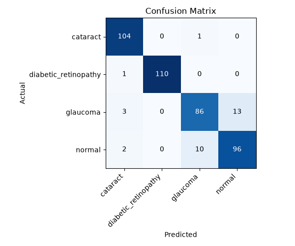
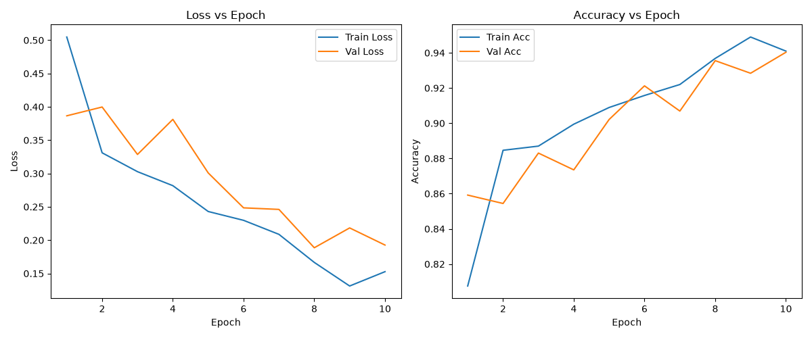
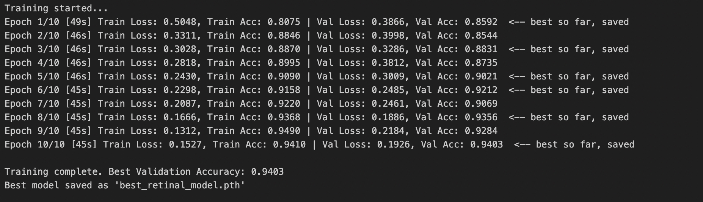
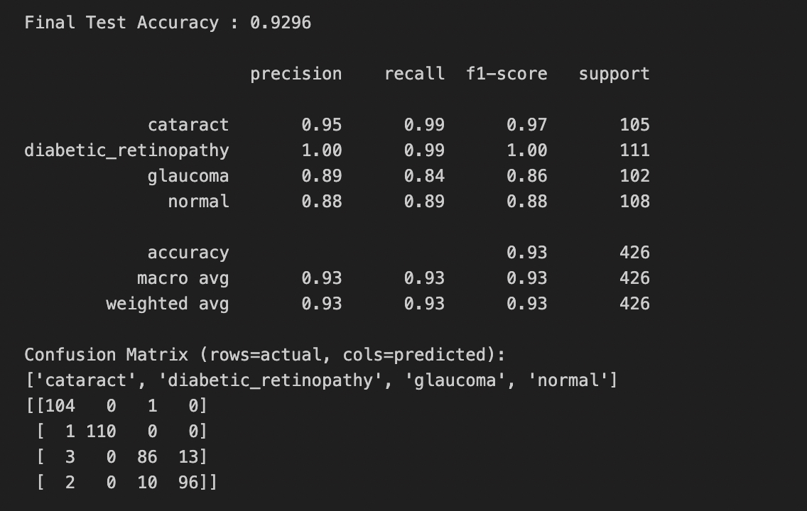
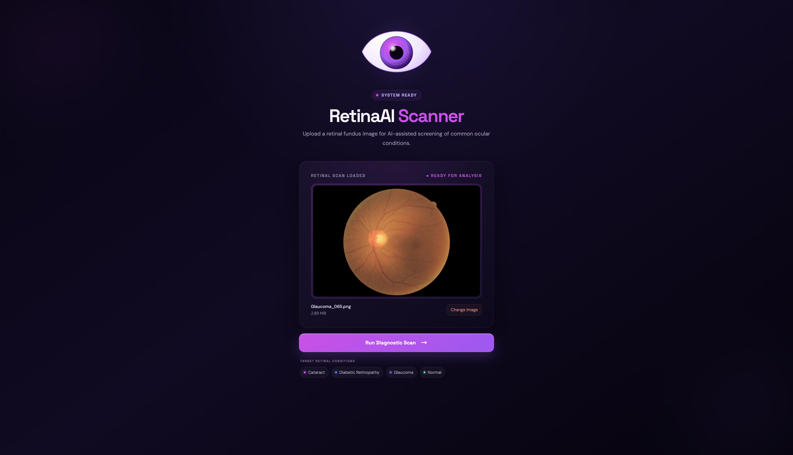
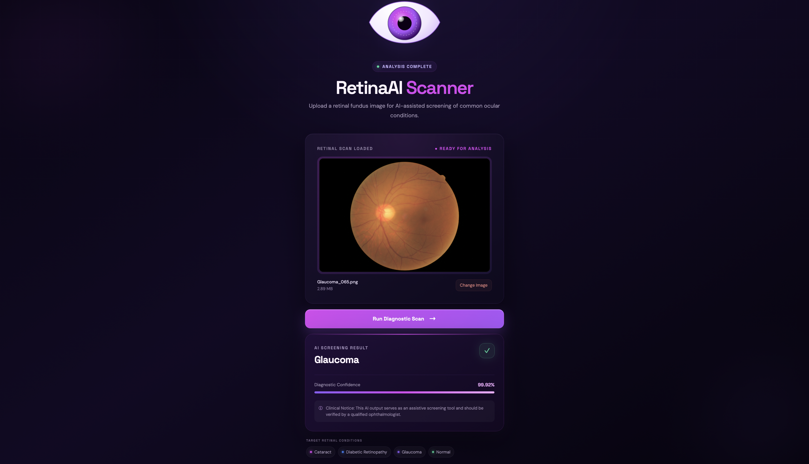

# Retinal-Disease-Classification-using-Deep-Learning

An end-to-end deep learning project that classifies retinal fundus images into four categories — **Cataract**, **Diabetic Retinopathy**, **Glaucoma**, and **Normal** — using a fine-tuned ResNet18 model, served through a FastAPI backend and a React frontend called **RetinaAI Scanner**.

> **Clinical Notice:** This project is an assistive screening tool built for educational purposes. 

## Table of Contents

- [Overview](#overview)
- [Dataset](#dataset)
- [Project Workflow](#project-workflow)
- [Model](#model)
- [Results](#results)
- [Screenshots](#screenshots)
- [Tech Stack](#tech-stack)
- [Project Structure](#project-structure)
- [Installation](#installation)
- [Usage](#usage)
- [Known Limitations](#known-limitations)
- [Future Improvements](#future-improvements)
- [License](#license)

## Overview

Retinal-Disease-Classification-using-Deep-Learning takes a retinal fundus image as input and classifies it into one of four categories using transfer learning on a ResNet18 backbone. The project has three parts:

1. **Data preparation** (`split_dataset_folders.py`) — splits the raw, class-labeled image dataset into train/val/test folders.
2. **Model training** (`model_training.ipynb`) — fine-tunes a pretrained ResNet18 on the split dataset and evaluates it on a held-out test set.
3. **Serving** (`main.py` + `frontend/`) — a FastAPI backend loads the trained weights and exposes a `/predict` endpoint, consumed by the React frontend where users can drag-and-drop a scan and get an instant screening result with a confidence score.

## Dataset

The `dataset/` folder contains labeled retinal fundus images organized into four class subfolders (`cataract`, `diabetic_retinopathy`, `glaucoma`, `normal`):

| Class | Total Images |
|---|---|
| Cataract | 1,038 |
| Diabetic Retinopathy | 1,098 |
| Glaucoma | 1,007 |
| Normal | 1,074 |

Images are split **80% train / 10% validation / 10% test**, stratified per class, using a fixed random seed (`42`) for reproducibility. The file listing is sorted before shuffling so the split is identical across machines and operating systems.

| Class | Train | Val | Test |
|---|---|---|---|
| Cataract | 830 | 103 | 105 |
| Diabetic Retinopathy | 878 | 109 | 111 |
| Glaucoma | 805 | 100 | 102 |
| Normal | 859 | 107 | 108 |
| **Total** | **3,372** | **419** | **426** |

## Project Workflow

1. **Dataset Splitting** (`split_dataset_folders.py`)
   - Reads the raw `dataset/` folder (one subfolder per class).
   - Sorts each class's file list for deterministic ordering, then shuffles with a fixed seed.
   - Copies files into `dataset_split/train`, `dataset_split/val`, and `dataset_split/test` (generated locally, not committed to the repo).

2. **Model Training** (`model_training.ipynb`)
   - Loads the split dataset with `torchvision.datasets.ImageFolder`.
   - Applies data augmentation (horizontal flip, random rotation) to the training set only; validation/test use a plain resize + normalize pipeline.
   - Fine-tunes a pretrained **ResNet18** (ImageNet weights) with its final layer replaced for 4-class output.
   - Trains for 10 epochs with the Adam optimizer and a step-decay learning rate schedule, saving only the checkpoint with the best validation accuracy.
   - Evaluates the best checkpoint on the test set and saves `training_curves.png` and `confusion_matrix.png`.

3. **Backend API** (`main.py`)
   - Loads the trained ResNet18 weights (`best_retinal_model.pth`) on CPU for inference.
   - Exposes a `POST /predict` endpoint that accepts an image file, runs it through the same preprocessing pipeline used at validation/test time, and returns the predicted class with a confidence score.

4. **Frontend** (`frontend/`)
   - A React (Vite) single-page app for uploading or dragging in a retinal scan.
   - Shows a live preview, sends the image to the backend, and displays the predicted condition with a confidence bar and a clinical disclaimer.

## Model

| Setting | Value |
|---|---|
| Architecture | ResNet18 (ImageNet-pretrained, fine-tuned) |
| Input size | 224 × 224 |
| Optimizer | Adam, `lr=0.001` |
| LR Schedule | StepLR (`step_size=7`, `gamma=0.5`) |
| Loss | CrossEntropyLoss |
| Batch size | 32 |
| Epochs | 10 |
| Seed | 42 |
| Device | Apple MPS (falls back to CPU) |

The checkpoint with the **highest validation accuracy** (not the last epoch) is the one saved and used for final evaluation and inference — this avoids shipping an overfit or under-trained model.

## Results

**Best Validation Accuracy:** 94.03% (epoch 10)
**Final Test Accuracy:** 92.96% (426 test images)

| Class | Precision | Recall | F1-score | Support |
|---|---|---|---|---|
| Cataract | 0.95 | 0.99 | 0.97 | 105 |
| Diabetic Retinopathy | 1.00 | 0.99 | 1.00 | 111 |
| Glaucoma | 0.89 | 0.84 | 0.86 | 102 |
| Normal | 0.88 | 0.89 | 0.88 | 108 |
| **Accuracy** | | | **0.93** | 426 |

**Confusion Matrix** (rows = actual, columns = predicted):



```
                        cataract  DR   glaucoma  normal
cataract                  104     0      1         0
diabetic_retinopathy        1   110      0         0
glaucoma                    3     0     86        13
normal                      2     0     10        96
```

**Training curves:**



**Key takeaways:**
- Cataract and Diabetic Retinopathy are classified with very high precision and recall.
- Glaucoma has the lowest recall (0.84) — 13 glaucoma cases are misclassified as Normal, which is the most clinically significant error type in this model, since it represents a missed diagnosis rather than a false alarm.
- Diabetic Retinopathy's near-perfect score should be interpreted with some caution: it has not yet been verified whether the source dataset contains multiple images per patient, which — if split across train and test — could inflate this number through data leakage.

## Screenshots

| | |
|---|---|
|  |  |
|  |  |
|  |  |

## Tech Stack

- **Model training:** Python, PyTorch, torchvision, scikit-learn, matplotlib
- **Backend:** FastAPI, Uvicorn, Pillow
- **Frontend:** React, Vite, plain CSS

## Project Structure

```
.
├── dataset/                     # Raw dataset (class-per-folder)
│   ├── cataract/
│   ├── diabetic_retinopathy/
│   ├── glaucoma/
│   └── normal/
├── frontend/                    # React (Vite) frontend
│   ├── public/
│   └── src/
│       ├── assets/
│       ├── App.jsx              # Upload, preview, and result UI
│       ├── index.css            # Styling for the frontend
│       └── main.jsx             # React app entry point
├── main.py                      # FastAPI backend serving predictions
├── model_training.ipynb         # Training, evaluation, and plotting pipeline
├── split_dataset_folders.py     # Splits raw dataset into train/val/test folders
├── confusion_matrix.png         # Test set confusion matrix
├── training_curves.png          # Loss & accuracy curves
├── image1.png ... image 6.png   # Web App screenshots
└── README.md
```

> `best_retinal_model.pth` and `dataset_split/` are generated locally by running the training pipeline and are not committed to the repo — see [Usage](#usage).

## Installation

**Backend & training:**
```bash
pip install torch torchvision fastapi uvicorn python-multipart pillow scikit-learn matplotlib numpy
```

**Frontend:**
```bash
cd frontend
npm install
```

## Usage

1. **Prepare the dataset.** With your raw images already in `./dataset/<class_name>/`, run:
   ```bash
   python split_dataset_folders.py
   ```
   This creates `./dataset_split/train`, `./dataset_split/val`, and `./dataset_split/test`.

2. **Train the model.** Open and run `model_training.ipynb` top to bottom. This will:
   - Print per-epoch training/validation metrics.
   - Save the best checkpoint as `best_retinal_model.pth`.
   - Save `training_curves.png` and `confusion_matrix.png`.
   - Print a final classification report on the test set.

3. **Run the backend.** Make sure `best_retinal_model.pth` is in the same directory as `main.py`, then:
   ```bash
   python main.py
   ```
   The API will be available at `http://127.0.0.1:8000`, with the prediction endpoint at `POST /predict`.

4. **Run the frontend.**
   ```bash
   cd frontend
   npm run dev
   ```
   Open the app in your browser, upload a retinal fundus image, and click **Run Diagnostic Scan**.

## Known Limitations

- **Glaucoma recall (84%)** is the weakest metric — a meaningful share of glaucoma cases are predicted as Normal. This should be improved before any real-world use.
- **Potential data leakage risk** for Diabetic Retinopathy's near-perfect score has not been ruled out; this depends on whether the dataset contains multiple images per patient.
- **Aspect ratio distortion:** images are resized directly to 224×224 without preserving aspect ratio, which can distort non-square source images.
- The model has only been trained and evaluated on this specific dataset and has not been validated against external, independently collected retinal images.

## Future Improvements

- Verify and, if necessary, correct for per-patient duplication in the dataset before trusting the Diabetic Retinopathy score.
- Train for more epochs with a lighter class-weighting scheme, or apply targeted augmentation to the Glaucoma class, to close the recall gap.
- Switch to `Resize(256) → CenterCrop(224)` preprocessing to avoid aspect-ratio distortion.
- Add file-resolution validation on upload to match the level of detail implied by the UI copy.

## License

This project is intended for educational and research purposes. It is **not a certified medical device** and should not be used for real clinical diagnosis without proper regulatory validation. 
